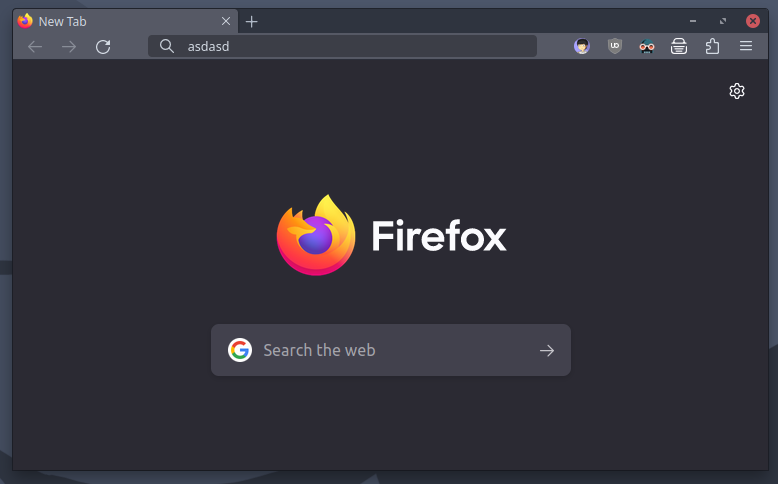

# Firefox Xtra Compact

Aiming to make Firefox more compact to give a tiny bit more web view area for low-screen devices.

*Screenshot taken from a 1366x768 monitor.*

*Left is Firefox with Compact density enabled. Right is the Xtra Compact.*

*The size height of the image above is the total used height (in pixels) of the whole nav bar.*

## Installation
*Instructions taken from [FirefoxCSS' Generic Installation](https://github.com/FirefoxCSS-Store/FirefoxCSS-Store.github.io/blob/main/README.md#generic-installation)*

1. Download the `userChrome.css` by clicking [here](https://github.com/CarterSnich/firefox-xtra-compact/raw/master/userChrome.css).
2. Open `about:config` page.
3. A dialog will warn you, but ignore it, ~~just do it~~ press the `I accept the risk!` button.
4. Search for these:

	+ **`toolkit.legacyUserProfileCustomizations.stylesheets`**
	+ **`layers.acceleration.force-enabled`**
	+ **`gfx.webrender.all`**
	+ **`gfx.webrender.enabled`**
	+ **`layout.css.backdrop-filter.enabled`**
	+ **`svg.context-properties.content.enabled`**

	Then make sure to **enable them all!**

5. Go to your Firefox profile.

	+ Linux - `$HOME/.mozilla/firefox/XXXXXXX.default-XXXXXX/`.
	+ Windows - `C:\Users\<USERNAME>\AppData\Roaming\Mozilla\Firefox\Profiles\XXXXXXX.default-XXXXXX`.
	+ macOS - `Users/<USERNAME>/Library/Application Support/Firefox/Profiles/XXXXXXX.default-XXXXXXX`.

6. Create a folder `chrome`, if it does not exist.
7. Copy the `userChrome.css` you downloaded earlier into `chrome` folder.
8. Restart Firefox.

## Todo

- [x] remove pre tab spacer
- [x] make toolbar below title bar more compact
- [ ] one liner option
