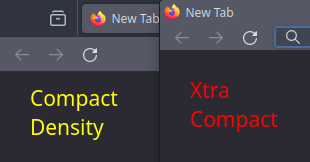

# Firefox Xtra Compact

Aiming to make Firefox more compact to give a tiny bit more web view area for low-screen devices.

*Screenshot taken from a 1366x768 monitor.*

*Left is Firefox with Compact density enabled. Right is the Xtra Compact.*

*The size height of the image above is the total used height (in pixels) of the whole nav bar.*

## Todo

- [x] remove pre tab spacer
- [x] make toolbar below title bar more compact
- [ ] one liner option
